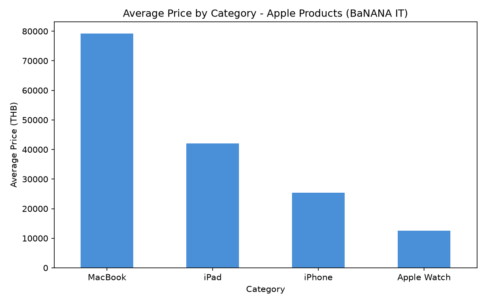

# BaNANA IT Product Data Pipeline

โปรเจกต์ Data Engineering ครบวงจร: ดึงข้อมูลสินค้าจากเว็บ e-commerce จริง (BaNANA IT),
ทำความสะอาดข้อมูล และเปิดให้เข้าถึงผ่าน REST API ของตัวเอง

## ทำไมถึงทำโปรเจกต์นี้

โปรเจกต์นี้จำลองงานจริงของตำแหน่ง Data Engineer / Data Operations โดยครอบคลุม
end-to-end pipeline ตั้งแต่ดึงข้อมูลดิบจนถึงเปิดให้ระบบอื่นเรียกใช้ได้จริง

## สถาปัตยกรรม (Architecture)
## Phase 1: Web Scraping

- ดึงข้อมูลสินค้าจาก [bnn.in.th](https://www.bnn.in.th) (BaNANA IT) หมวด Apple
  (iPhone, iPad, MacBook, Apple Watch)
- แกะข้อมูลด้วย BeautifulSoup จาก CSS selector ที่หาเองผ่าน browser inspection
- ทำความสะอาดข้อมูลราคาด้วย regular expression (แปลงจาก string เช่น "฿24,700 - ฿46,700"
  ให้เป็นตัวเลขที่วิเคราะห์ได้)
- ดึงข้อมูลอย่างมีความรับผิดชอบ: จำกัดจำนวนหมวดหมู่ ใส่ delay ระหว่าง request
  ใช้ User-Agent ที่ระบุวัตถุประสงค์ชัดเจน

**ไฟล์:** `scraper.py`
**ผลลัพธ์:** `banana_apple_products.csv` (87 รายการ, 4 หมวดหมู่)

## Phase 2: REST API

สร้าง API ด้วย FastAPI เปิดให้เข้าถึงข้อมูลที่ดึงมาผ่าน HTTP endpoints:

| Endpoint | คำอธิบาย |
|---|---|
| `GET /` | หน้าแรก |
| `GET /products` | ดึงสินค้าทั้งหมด |
| `GET /products/category/{category_name}` | กรองตามหมวดหมู่ (เช่น iPhone, iPad) |
| `GET /products/under/{max_price}` | กรองสินค้าที่ราคาเริ่มต้นไม่เกินที่กำหนด |
| `GET /products/search?q={query}` | ค้นหาสินค้าด้วยภาษาธรรมชาติ (semantic search) |

รองรับ error handling (คืน HTTP 404 พร้อมข้อความ เมื่อหาหมวดหมู่ไม่พบ)
มีเอกสาร API แบบ interactive อัตโนมัติที่ `/docs` (Swagger UI)

**ไฟล์:** `api.py`

## Phase 3: Data Analysis & Visualization

วิเคราะห์ข้อมูลสินค้าด้วย pandas เพื่อหา insight เชิงธุรกิจ:

- เปรียบเทียบราคาเฉลี่ยแต่ละหมวดหมู่ (`groupby`)
- หาสินค้าที่แพงที่สุด/ถูกที่สุดในแต่ละหมวด
- สรุปสถิติราคาทั้งหมด (mean, median, std, quartiles)
- สร้างกราฟแท่งเปรียบเทียบด้วย matplotlib

**ผลลัพธ์:** MacBook มีราคาเฉลี่ยสูงสุด (~79,200 บาท) สูงกว่า iPad เกือบ 2 เท่า
และสูงกว่า Apple Watch กว่า 6 เท่า

**ไฟล์:** `analysis.py`, `price_by_category.png`



## Phase 4: SQL Database

โหลดข้อมูลเข้า SQLite และเขียน SQL query ระดับกลาง-สูง เพื่อฝึกและโชว์ทักษะ SQL:

- **Aggregate + GROUP BY** — สรุปสถิติราคาแยกตามหมวดหมู่
- **Window Function** (`RANK() OVER PARTITION BY`) — จัดอันดับสินค้าแพงสุดในแต่ละหมวด
  โดยไม่ยุบข้อมูล
- **Correlated Subquery** — หาสินค้าที่ราคาสูงกว่าค่าเฉลี่ยของหมวดตัวเอง

**ไฟล์:** `load_to_db.py`, `sql_queries.py`

## Phase 5: Semantic Search (Vector DB / RAG)

เพิ่มความสามารถค้นหาสินค้าด้วยภาษาธรรมชาติ โดยใช้ ChromaDB แปลงชื่อ+รายละเอียดสินค้า
เป็นเวกเตอร์ (embeddings) แล้วค้นหาจาก "ความหมาย" แทนการจับคู่ keyword ตรงๆ

ตัวอย่าง: ค้นหา `"laptop for video editing"` แล้วระบบเข้าใจและแนะนำ MacBook Pro
สเปคสูง (M5 Pro/Max) ได้ ทั้งที่ในข้อมูลไม่มีคำว่า "video editing" อยู่เลย

เชื่อมเข้ากับ FastAPI เป็น endpoint ใหม่: `GET /products/search?q={คำค้นหา}`

**ไฟล์:** `vector_search.py`, endpoint ใน `api.py`

## Phase 6: Cloud Data Warehouse (Google BigQuery)

โหลดข้อมูลจาก local CSV ขึ้น Google BigQuery เพื่อจำลอง production data warehouse
ที่ใช้งานจริงในองค์กร:

- ตั้งค่า GCP project และ authentication ผ่าน `gcloud` CLI
- สร้าง dataset/table บน BigQuery ด้วย `google-cloud-bigquery`
- รัน SQL query แบบเดียวกับ Phase 4 บน cloud (เทียบผลลัพธ์ได้ตรงกัน
  ยืนยันความถูกต้องของข้อมูล)

**ไฟล์:** `load_to_bigquery.py`, `bigquery_queries.py`

## เทคโนโลยีที่ใช้

- **Python 3.14**
- **requests, BeautifulSoup4** — web scraping
- **pandas, re** — data cleaning & processing
- **FastAPI, Uvicorn** — REST API
- **SQLite** — relational database
- **ChromaDB** — vector database สำหรับ semantic search

## วิธีรันโปรเจกต์

```bash
# ติดตั้ง dependencies
pip install requests beautifulsoup4 pandas fastapi uvicorn

# รัน scraper เพื่อดึงข้อมูลใหม่
python3 scraper.py

# รัน API server
uvicorn api:app --reload

# เปิดดูเอกสาร API แบบ interactive
# http://127.0.0.1:8000/docs
```

## แผนพัฒนาต่อ (Roadmap)

- [x] Data analysis: เปรียบเทียบราคาเฉลี่ยแต่ละหมวดหมู่ด้วย pandas
- [x] SQL database: โหลดข้อมูลเข้า SQLite พร้อม complex queries
- [x] Semantic search: Vector DB (ChromaDB) + RAG-style search endpoint
- [x] Cloud data warehouse: โหลดข้อมูลเข้า Google BigQuery
- [ ] เพิ่ม data quality checks (ตรวจสอบ null, ค่าผิดปกติ)
- [ ] เพิ่ม scheduled scraping (รันอัตโนมัติทุกวัน)

## หมายเหตุสำคัญ

โปรเจกต์นี้ทำเพื่อการเรียนรู้และพอร์ตโฟลิโอส่วนตัวเท่านั้น (educational/personal use)
ไม่ใช้เพื่อการค้าหรือเผยแพร่ข้อมูลจำนวนมาก ดึงข้อมูลในปริมาณจำกัดและเว้นระยะเวลา
ระหว่าง request เพื่อไม่ให้เป็นภาระต่อเซิร์ฟเวอร์ปลายทาง